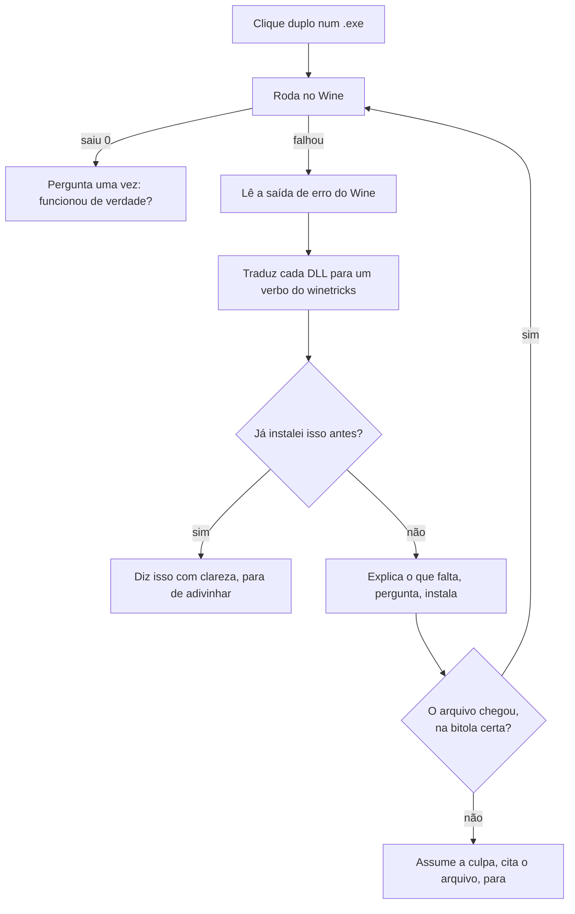

<div align="center">

# Tandem

### Clique duas vezes num arquivo. Ele funciona.

**`.exe` · `.msi` · `.apk` · `.xapk` · `.AppImage` · `.jar` no Linux — sem terminal, sem tutorial, sem você precisar aprender o que é um "verbo do winetricks".**

[](https://github.com/ChrnX0/Tandem/actions/workflows/ci.yml)
[](tests/run.sh)
[](https://github.com/ChrnX0/Tandem/actions/workflows/real-programs.yml)
[](https://lintian.debian.org/)
[](build.py)
[](LICENSE)

**[English](README.md)** · [Como colaborar](CONTRIBUINDO.md) · [Ideário](docs/IDEAS.md) · [Formato da lista](docs/LIST-FORMAT.md)


</div>

---

## A diferença, num relance

<table>
<tr>
<th width="50%">Fazer um programa Windows rodar hoje</th>
<th width="50%">Com o Tandem</th>
</tr>
<tr>
<td>

```console
$ sudo apt install wine winetricks
$ WINEPREFIX=~/.wine-app winecfg
$ wine setup.exe
0024:err:module:import_dll Library
MSVCP140.dll not found
$ # ...que pacote é esse?
$ # (abre um fórum, lê 40 respostas)
$ winetricks -q vcrun2019
$ wine setup.exe
0024:err:module:import_dll Library
VCRUNTIME140_1.dll not found
$ # (volta pro fórum)
```

</td>
<td>

<br>

### Clique duas vezes.

<br>

Se faltar alguma coisa, o Tandem descobre, diz numa frase que você entende, pergunta uma vez e instala.

Se **não tiver como** funcionar, ele diz isso também — **antes** de você gastar meia hora de download.

<br>

</td>
</tr>
</table>

---

## O que ele faz de diferente

Wine, Bottles, Lutris e PlayOnLinux todos rodam programas Windows, e fazem isso bem. O que nenhum deles faz é **fechar o laço de diagnóstico para quem não sabe ler um log**. O Tandem é isso, e só isso.

### 🔁 Ele lê a saída de erro do próprio Wine e age

Quando um programa falha, o Wine escreve `err:module:import_dll Library MSVCP140.dll not found`. O Tandem lê essas linhas, traduz cada DLL para o pacote que a fornece, instala e tenta de novo — é o laço que uma pessoa experiente faria à mão.



### 🧾 Terminar não é a mesma coisa que funcionar

O `winetricks` sair `0` diz que **ele** terminou, não que o arquivo que faltava chegou. O Tandem confere se a DLL está lá de verdade — *e na bitola certa*. Um programa de 64 bits não carrega DLL de 32 bits de dentro da `syswow64`, e boa parte dos pacotes do `winetricks` só tem carga de 32.

Quando é esse o caso, você fica sabendo **antes** do download:

<div align="center">

</div>

### 🙋 Ele assume a culpa quando a culpa é dele

*"Instalei as dependências e ainda não abre"* manda um dono de loja procurar defeito numa máquina que está perfeita. O Tandem cita o arquivo que continua faltando e diz de quem é o problema:

<div align="center">

</div>

### 🔇 Nenhum caminho de erro termina em silêncio

"Cliquei duas vezes e não aconteceu nada" é tratado como **defeito**, não como limitação. Toda falha termina numa janela; sem sessão gráfica, no terminal; e sempre no log. Essa regra já pegou uma janela de erro que nunca abria, uma barra de progresso que derrubava o programa inteiro, e um desvio que calava a saída do próprio programa.

### 🔒 Ele não mexe em perfil Wine que não criou

Perfil que o Tandem não fez é **somente leitura para a automação**. Se o seu programa mora dentro de um, o Tandem roda ele *lá*, informa o que falta e **para**.

> Isso existe porque o projeto nasceu numa máquina que também roda um sistema de frente de caixa em perfil próprio. Automação que "gentilmente" instala uma dependência dentro de um ambiente de produção que funciona é pior do que não automatizar nada.

```bash
tandem protect ~/.wine-pdv     # marca qualquer perfil como intocável
```

---

## Instalação

Baixe o `.deb` em **[Releases](../../releases/latest)** e clique duas vezes. Ou, pelo terminal:

```bash
curl -LO https://github.com/ChrnX0/Tandem/releases/latest/download/tandem_3.7_all.deb
sudo apt install ./tandem_3.7_all.deb
```

<details>
<summary>Compilar por conta própria, e conferir o que você baixou</summary>

<br>

A construção é reprodutível: o `.deb` anexado ao release é byte a byte idêntico ao que sai deste repositório, então você pode conferir em vez de confiar. Não precisa de máquina Debian nem do `dpkg-deb` — o empacotador escreve o arquivo `ar` sozinho, em qualquer sistema.

```bash
git clone https://github.com/ChrnX0/Tandem && cd Tandem
python3 build.py --check
sha256sum tandem_3.7_all.deb          # compare com o .sha256 do release
```

Todo release é construído pelo workflow em [`.github/workflows/release.yml`](.github/workflows/release.yml), que roda a suíte e o `lintian`, depois instala, configura e remove o pacote de verdade num Ubuntu 24.04 — e só publica se tudo isso passar.

</details>

Depois, deixe o Tandem instalar o que faltar:

```bash
tandem preparar
```

<details>
<summary>O que o <code>tandem preparar</code> faz de fato, e por que é um comando separado</summary>

<br>

Ele instala Wine, `winetricks`, suporte a 32 bits, `adb`, o Java, a biblioteca do FUSE e o Waydroid — inclusive o repositório do Waydroid com a chave, na ordem certa — e pede a senha uma vez só.

Isso não pode acontecer durante a instalação do `.deb`: o `dpkg` segura uma trava enquanto o `postinst` roda, e um `apt-get` lá dentro esperaria para sempre. O clique duplo num `.exe` sem Wine também oferece instalar na hora, porque é aí que a pessoa quer resolver.

</details>

### Requisitos

| Para | Você precisa de |
|---|---|
| Programas Windows de 64 bits | `wine` — o caso normal, mais nada |
| Programas Windows de 32 bits | também `wine32` (`sudo dpkg --add-architecture i386`) |
| Dependências automáticas | `winetricks` |
| Aplicativos Android | [`waydroid`](https://docs.waydro.id/), inicializado |
| Pacotes divididos (`.xapk`) | `adb` |
| Programas `.jar` | `java` — o pacote `default-jre` |
| `.AppImage` na velocidade cheia | `libfuse2t64` (sem ele o Tandem desempacota, e avisa) |
| Apps só-ARM em x86 | [libhoudini / libndk](https://github.com/casualsnek/waydroid_script) |

Testado no Zorin OS 18.1 e no Ubuntu 24.04. Deve funcionar em qualquer distribuição baseada em Debian com um desktop que siga o freedesktop.

---

## Android também

- **Ele analisa o pacote antes de instalar.** Um leitor de XML binário embutido — sem precisar do SDK do Android — extrai o nome do pacote, o `minSdkVersion` e as arquiteturas nativas, e compara com o Android em execução. Você é avisado: *"este app exige Android 15, o seu é 13"*, em vez de assistir a uma instalação falhar.
- **Ele dá conta de pacote dividido.** `.xapk`, `.apks` e `.apkm` são extraídos e instalados pelo ADB com `install-multiple`, dados OBB incluídos. A maioria dos apps grandes vem assim, e um instalador comum não resolve.
- **Ele lê o resultado de verdade.** O `waydroid app install` sai `0` mesmo falhando. O Tandem lê a saída e transforma `NO_MATCHING_ABIS` em *"este app é feito só para celular e não roda aqui"*.
- **Ele espera o sinal certo.** `Session: RUNNING` significa que o gerenciador de sessão subiu, não que o Android terminou de ligar. O Tandem espera o `sys.boot_completed`.

---

## Os formatos que o próprio Linux usa

Dois deles falham no clique duplo por motivos que não têm nada a ver com o Wine, e tudo a ver com o Linux. O Tandem trata os dois como trata um `.exe`: lê o arquivo primeiro, explica numa frase, e conserta o que dá para consertar.

### `.AppImage` — um arquivo só, sem instalar, e um clique duplo que não faz nada

Um AppImage chega do navegador **sem a permissão de execução**, e um arquivo sem essa permissão nem é oferecido ao sistema como programa. O clique abre um descompactador, ou não acontece nada, e a culpa fica com o arquivo. O Tandem marca a permissão — você clicou duas vezes, já disse que quer abrir.

Depois vêm as falhas seguintes, todas lidas do arquivo antes de executar coisa alguma:

| O que está errado | O que você ouve |
|---|---|
| O download foi cortado no meio | *"o download deste arquivo não terminou"* — o arquivo diz por dentro que deveria ser maior do que é |
| Feito para outro processador | *"ele é para `aarch64` e este computador é `x86_64`"* |
| Falta o FUSE | nada — o Tandem **contorna**, desempacotando em vez de montar, e depois conta a linha única que resolve de vez |
| Feito numa distribuição mais nova | *"este programa é mais novo que o seu sistema Linux"*, com a GLIBC que ele pede — e que instalar coisa nenhuma resolve |
| Num pendrive montado com `noexec` | *"esta pasta não deixa executar nada; copie para a sua pasta pessoal"* |

Ele também coloca o programa **no seu menu de aplicativos**, usando o atalho que o próprio AppImage carrega por dentro. Desempacotar não monta nada, então isso funciona exatamente nas máquinas que não têm FUSE. Se depois você apagar o arquivo, o atalho se apaga sozinho.

### `.jar` — o Java responde em números que ninguém sabe usar

Duas falhas cobrem quase todas, e o Java descreve as duas em palavras que quem clicou não tem como aproveitar.

**`no main manifest attribute`** quer dizer que o arquivo é uma *peça* de um programa, não um programa. Os dois tipos de `.jar` são indistinguíveis por fora — mesma extensão, mesmo ícone — então não havia como saber que você baixou o errado. O Tandem lê o manifesto e diz.

**`UnsupportedClassVersionError: class file version 65.0`** quer dizer que ele precisa de um Java mais novo. O número que está na página de download é `21`. A diferença entre os dois é 44. O Tandem faz essa subtração **antes de executar qualquer coisa**, e oferece instalar a versão que o programa pede:

```
Este programa precisa de uma versão mais nova do Java.

Ele pede o Java 22 e o instalado aqui é o 21.

Para instalar a versão que ele pede:

sudo apt install openjdk-22-jre
```

---

## Comandos

Você quase não vai precisar disto — o normal é clicar duas vezes. Quando quiser a linha de comando:

| | |
|---|---|
| `tandem` | o painel |
| `tandem install <arquivo>` | instala ou executa qualquer coisa |
| `tandem preparar` | instala o que falta (Wine, Java, Android, …) |
| `tandem programas` | lista e abre os programas instalados, Windows e AppImage |
| `tandem desinstalar` | remove um programa Windows instalado |
| `tandem android` | abre a tela do Android |
| `tandem doctor` | diagnóstico do ambiente — o que **existe** |
| `tandem autoteste` | exercita aqui — o que **funciona** |
| `tandem repair` | reaplica as associações de arquivo |
| `tandem dados` | mostra os **seus** arquivos dentro do Windows |
| `tandem backup` · `tandem restore` | salva e restaura o ambiente inteiro |
| `tandem protect <caminho>` | marca um perfil Wine como intocável |
| `tandem alternativas <nome>` | procura um programa de Linux que faça o mesmo |
| `tandem receita <arquivo>` | exporta o que aprendeu, para mandar a alguém |
| `tandem memoria` · `tandem esquecer <nome>` | vê e apaga o que ele aprendeu |
| `tandem lista` · `tandem contribuir <arquivo>` | a lista da comunidade, nos dois sentidos |
| `tandem socorro` | um arquivo só com tudo, para pedir ajuda |
| `tandem logs` | o registro mais recente |

---

## Três ideias que valem a leitura

### 💾 Os seus dados não são o seu ambiente

O ambiente — o perfil, os componentes, os programas — o Tandem refaz em vinte minutos. O que você *digitou dentro* desses programas, não.

Nada neste projeto separava as duas coisas até a versão 3.4, e três caminhos apagavam dado do dono sem cópia. O `tandem dados` acha o que é seu (as pastas pessoais do Windows, mais os `.mdb`/`.fdb`/`.dbf` que software comercial larga ao lado do próprio executável) e copia só isso — pequeno o bastante para caber num e-mail.

```bash
tandem dados            # o que aqui dentro é meu, e quanto pesa?
tandem dados salvar     # copia só isso
tandem dados restaurar  # devolve, sem nunca sobrescrever
```

> **A promessa que isso existe para cumprir:** *se você desistir do Linux, seus dados voltam com você.*

### 🧠 Ele lembra, e nunca mente sobre o quanto tem certeza

O Tandem guarda o que cada programa precisou, indexado por uma impressão digital do **arquivo** — tamanho mais o primeiro e o último MiB — então a lição sobrevive a mudar de pasta e vale na máquina de outra pessoa.

Mas `exit 0` não é prova. O modo de falha característico do Wine com software comercial é **abrir e estar sutilmente errado**: cupom com acento quebrado, relatório em branco, data invertida. Então o Tandem pergunta a você, uma vez por programa, se funcionou de verdade — e toda lição que ele exporta sai marcada com a origem da confiança. "Uma pessoa olhou a tela" pesa diferente de "o processo saiu 0".

### 🌐 Uma lista da comunidade, não um servidor

O `tandem lista` baixa um arquivo de texto por HTTPS — o modelo das listas de filtro de bloqueador de anúncio. Sem API, sem conta, sem uptime para pagar; é por isso que o EasyList sobrevive há vinte anos com orçamento de voluntário.

**Ler é automático. Publicar não.** O `tandem contribuir` monta a linha e mostra ela inteira — *você* envia. A linha leva uma impressão digital do arquivo, a arquitetura e os componentes que resolveram, e **mais nada**: sem nome de arquivo, caminho, usuário, nome da máquina, IP nem log. O gerador se recusa a produzi-la se alguma dessas coisas aparecer. [Formato completo →](docs/LIST-FORMAT.md)

---

## O que nunca vai funcionar

Ser honesto sobre isso desde o começo economiza uma tarde de todo mundo.

| | Por quê |
|---|---|
| **Dispositivo USB dentro do Android** | O Waydroid não repassa USB. Impressora térmica, leitor de cartão, leitor de código de barras e balança não existem dentro do contêiner. Nenhuma automação muda isso. |
| **App de banco e de pagamento** | O Play Integrity detecta o contêiner. Não há contorno confiável. |
| **Programa Windows com driver de kernel** | Anti-cheat, alguns middlewares de pagamento de PDV, chave de proteção física. O Wine roda no espaço do usuário. |
| **Licença amarrada ao hardware** | O Wine informa serial de BIOS e de disco vazio ou sintético. Software que identifica a máquina pode recusar a ativação — ou travar na tela de ativação. |

O Tandem reconhece vários desses casos lendo o próprio executável, **antes de rodar**, e explica a falha em vez de mostrar um código de erro.

---

## Como colaborar

**A contribuição mais valiosa não exige código.**

O Tandem tem um problema honesto: quase nenhum programa *comercial* de verdade jamais rodou nele. Desde a versão 3.7 o laço é exercitado toda semana contra software Windows real de redistribuição livre, com captura de tela provando que a janela apareceu — mas isso ainda não é o sistema de uma loja em cima de um balcão. Cada relato de programa real vale mais que uma funcionalidade nova.

| Deu certo | Não deu certo |
|---|---|
| `tandem contribuir <arquivo>` monta uma linha anônima — [cole numa issue](../../issues/new?template=list.yml) | `tandem socorro` junta num arquivo só tudo o que alguém perguntaria — [abra uma issue](../../issues/new?template=did-not-work.yml) |

As cinco regras que não se quebram, e a régua de evidência que "pronto" precisa alcançar, estão em **[CONTRIBUINDO.md](CONTRIBUINDO.md)**. Antes de propor coisa nova, dê uma olhada em **[docs/IDEAS.md](docs/IDEAS.md)** — 52 ideias com veredito, e as recusadas trazem o motivo escrito.

<details>
<summary><b>Compilar e testar</b></summary>

<br>

```bash
python3 build.py --check   # empacota; sem Debian, sem dpkg-deb
bash tests/run.sh          # 364 testes; sem Wine, sem Waydroid, sem instalar
```

A suíte carrega as bibliotecas direto de `src/lib` e gera pacotes Android sintéticos com `AndroidManifest.xml` binário de verdade, então o leitor de manifesto roda no mesmo caminho de código de um APK real. Ferramenta opcional (`shellcheck`, `dpkg-deb`, `desktop-file-validate`) é usada quando existe e pulada quando não existe, então a suíte passa numa máquina pelada.

O CI ainda roda o `lintian` sem nenhum aviso, confere que a construção é byte a byte reprodutível, e faz um ciclo real de instalar–configurar–remover num Ubuntu 24.04.

Um segundo fluxo roda **programas de verdade** toda semana: PuTTY, Notepad++, 7-Zip e WinMerge, cada um fixado por `sha256`, cada um passando pelo Tandem — e depois ele olha a tela com o `xdotool`, porque um programa que sai `0` sem desenhar janela nenhuma é exatamente como o Wine falha com software comercial. Ele também constrói um AppImage de verdade com o `appimagetool` de verdade e compila um `.jar` de verdade, e confere os dois leitores contra as implementações de referência deles.

</details>

---

<div align="center">

**MIT** · [LICENSE](LICENSE)

<sub>Feito para um dono de loja que não é programador, e julgado por uma regra:<br>nenhum caminho de erro pode terminar em silêncio.</sub>

</div>
