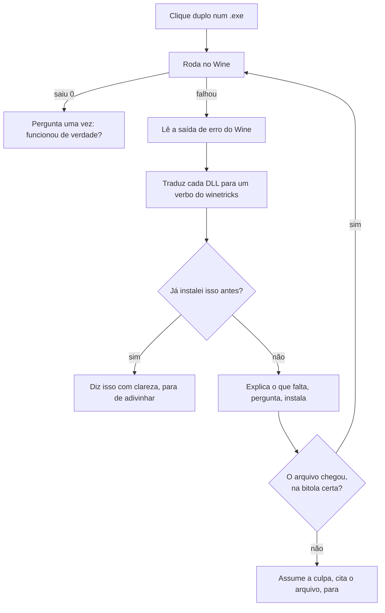

<div align="center">

# Tandem

### Clique duas vezes num arquivo. Ele funciona.

**Nove formatos. `.exe` `.msi` · `.apk` `.xapk` · `.AppImage` `.jar` · `.deb` `.rpm` `.flatpakref` `.snap` — sem terminal, sem tutorial, sem você precisar aprender o que é um "verbo do winetricks".**

[](https://github.com/ChrnX0/Tandem/actions/workflows/ci.yml)
[](tests/run.sh)
[](https://github.com/ChrnX0/Tandem/actions/workflows/real-programs.yml)
[](https://lintian.debian.org/)
[](build.py)
[](LICENSE)

**[English](README.md)** · [Como colaborar](CONTRIBUINDO.md) · [Ideário](docs/IDEAS.md) · [Formato da lista](docs/LIST-FORMAT.md)


</div>

---

## A diferença, num relance

<table>
<tr>
<th width="50%">Fazer um programa Windows rodar hoje</th>
<th width="50%">Com o Tandem</th>
</tr>
<tr>
<td>

```console
$ sudo apt install wine winetricks
$ WINEPREFIX=~/.wine-app winecfg
$ wine setup.exe
0024:err:module:import_dll Library
MSVCP140.dll not found
$ # ...que pacote é esse?
$ # (abre um fórum, lê 40 respostas)
$ winetricks -q vcrun2019
$ wine setup.exe
0024:err:module:import_dll Library
VCRUNTIME140_1.dll not found
$ # (volta pro fórum)
```

</td>
<td>

<br>

### Clique duas vezes.

<br>

Se faltar alguma coisa, o Tandem descobre, diz numa frase que você entende, pergunta uma vez e instala.

Se **não tiver como** funcionar, ele diz isso também — **antes** de você gastar meia hora de download.

<br>

</td>
</tr>
</table>

---

## O que ele faz de diferente

Wine, Bottles, Lutris e PlayOnLinux todos rodam programas Windows, e fazem isso bem. O que nenhum deles faz é **fechar o laço de diagnóstico para quem não sabe ler um log**. O Tandem é isso, e só isso.

<details>
<summary>Essa afirmação foi conferida no campo, e metade dela estava errada</summary>

<br>

**O Bottles detecta.** Desde a versão 61 (janeiro de 2026) ele traz um motor de análise chamado *Eagle* — 1145 linhas de `pefile` + 67 regras YARA + um banco de 6,3 MB — que lê a tabela de imports de um `.exe` desconhecido e **nomeia os componentes que faltam**, sem ninguém escolher de uma lista. Ele até extrai um instalador MSI ou Inno num sandbox para analisar os binários que *vão* ser instalados, o que é mais do que o `peinfo.py` do Tandem faz. As notas deste projeto afirmavam que ninguém fazia detecção automática. Estava errado, e está corrigido no `CLAUDE.md` com a evidência.

**Ninguém fecha o laço.** O Eagle propõe e para: as sugestões aparecem numa linha que não clica, e a pessoa instala à mão. Uma busca de código no GitHub por `"winetricks" "import_dll" language:python` devolve **dois** arquivos em todo o GitHub — um abandonado em 2018, outro com uma tabela de três entradas atrás de uma janela de log e um botão. `import_dll` devolve zero no Bottles, no Lutris, no Heroic, no PortProton, no Faugus, no umu-launcher e no ProtonUp-Qt. O PortProton e o umu-protonfixes *instalam* sem perguntar — porque um humano já escolheu, jogo por jogo, em 204 arquivos de banco e 477 scripts escritos à mão indexados por AppID da Steam. Para um programa sem receita escrita, não existe resposta em lugar nenhum.

Mais três coisas que a busca não encontrou ninguém fazendo, e que o Tandem faz:

- **Conferir se o arquivo chegou.** O `winetricks` tem 568 verbos e 19 funções de verificação — todas `dotnet*`, todas atrás de uma opção que ninguém liga. O Bottles não tem nenhuma checagem depois de instalar.
- **Comparar a bitola do DLL entregue com a do programa.** O `winetricks` entrega, sabendo, payloads de 32 bits no `syswow64` de um prefixo de 64, e nunca compara. Bottles e PortProtonQt leem o campo de arquitetura do PE e só imprimem.
- **Lembrar pela identidade do arquivo.** Todo esquema encontrado indexa por ID de loja ou nome de arquivo, então a lição morre quando o arquivo muda de pasta e nunca vai para outra máquina.

E do lado do AppImage, o placar honesto: a permissão de execução é resolvida por três projetos de três maneiras, e o atalho no menu é bem resolvido por dois. O contorno automático do FUSE, o veredito de download cortado, o diagnóstico de `noexec` e a explicação da GLIBC velha não apareceram em **nenhum** deles.

</details>

### 🔁 Ele lê a saída de erro do próprio Wine e age

Quando um programa falha, o Wine escreve `err:module:import_dll Library MSVCP140.dll not found`. O Tandem lê essas linhas, traduz cada DLL para o pacote que a fornece, instala e tenta de novo — é o laço que uma pessoa experiente faria à mão.



### 🧾 Terminar não é a mesma coisa que funcionar

O `winetricks` sair `0` diz que **ele** terminou, não que o arquivo que faltava chegou. O Tandem confere se a DLL está lá de verdade — *e na bitola certa*. Um programa de 64 bits não carrega DLL de 32 bits de dentro da `syswow64`, e boa parte dos pacotes do `winetricks` só tem carga de 32.

Quando é esse o caso, você fica sabendo **antes** do download:

<div align="center">

</div>

### 🙋 Ele assume a culpa quando a culpa é dele

*"Instalei as dependências e ainda não abre"* manda um dono de loja procurar defeito numa máquina que está perfeita. O Tandem cita o arquivo que continua faltando e diz de quem é o problema:

<div align="center">

</div>

### 🔇 Nenhum caminho de erro termina em silêncio

"Cliquei duas vezes e não aconteceu nada" é tratado como **defeito**, não como limitação. Toda falha termina numa janela; sem sessão gráfica, no terminal; e sempre no log. Essa regra já pegou uma janela de erro que nunca abria, uma barra de progresso que derrubava o programa inteiro, e um desvio que calava a saída do próprio programa.

### 🔒 Ele não mexe em perfil Wine que não criou

Perfil que o Tandem não fez é **somente leitura para a automação**. Se o seu programa mora dentro de um, o Tandem roda ele *lá*, informa o que falta e **para**.

> Isso existe porque o projeto nasceu numa máquina que também roda um sistema de frente de caixa em perfil próprio. Automação que "gentilmente" instala uma dependência dentro de um ambiente de produção que funciona é pior do que não automatizar nada.

```bash
tandem protect ~/.wine-pdv     # marca qualquer perfil como intocável
```

---

## Instalação

Baixe o `.deb` em **[Releases](../../releases/latest)** e clique duas vezes. Ou, pelo terminal:

```bash
curl -LO https://github.com/ChrnX0/Tandem/releases/latest/download/tandem_3.8_all.deb
sudo apt install ./tandem_3.8_all.deb
```

**Não usa Debian nem Ubuntu?** Fedora, Arch, openSUSE e as demais não têm `apt` para receber um `.deb`. Baixe o pacote genérico — `tandem_<versão>_generic.tar.gz` — na mesma página de **[Releases](../../releases/latest)** e rode o instalador; ele coloca exatamente os mesmos arquivos:

```bash
tar xzf tandem_*_generic.tar.gz && cd tandem-*
sudo ./install.sh          # sudo ./uninstall.sh remove de novo
```

<details>
<summary>Compilar por conta própria, e conferir o que você baixou</summary>

<br>

A construção é reprodutível: o `.deb` anexado ao release é byte a byte idêntico ao que sai deste repositório, então você pode conferir em vez de confiar. Não precisa de máquina Debian nem do `dpkg-deb` — o empacotador escreve o arquivo `ar` sozinho, em qualquer sistema.

```bash
git clone https://github.com/ChrnX0/Tandem && cd Tandem
python3 build.py --check
sha256sum tandem_3.8_all.deb          # compare com o .sha256 do release
```

Todo release é construído pelo workflow em [`.github/workflows/release.yml`](.github/workflows/release.yml), que roda a suíte e o `lintian`, depois instala, configura e remove o pacote de verdade num Ubuntu 24.04 — e só publica se tudo isso passar.

</details>

Depois, deixe o Tandem instalar o que faltar:

```bash
tandem preparar
```

<details>
<summary>O que o <code>tandem preparar</code> faz de fato, e por que é um comando separado</summary>

<br>

Ele instala Wine, `winetricks`, suporte a 32 bits, `adb`, o Java, a biblioteca do FUSE e o Waydroid — inclusive o repositório do Waydroid com a chave, na ordem certa — e pede a senha uma vez só.

Isso não pode acontecer durante a instalação do `.deb`: o `dpkg` segura uma trava enquanto o `postinst` roda, e um `apt-get` lá dentro esperaria para sempre. O clique duplo num `.exe` sem Wine também oferece instalar na hora, porque é aí que a pessoa quer resolver.

</details>

### Requisitos

| Para | Você precisa de |
|---|---|
| Programas Windows de 64 bits | `wine` — o caso normal, mais nada |
| Programas Windows de 32 bits | também `wine32` (`sudo dpkg --add-architecture i386`) |
| Dependências automáticas | `winetricks` |
| Aplicativos Android | [`waydroid`](https://docs.waydro.id/), inicializado |
| Pacotes divididos (`.xapk`) | `adb` |
| Programas `.jar` | `java` — o pacote `default-jre` |
| `.AppImage` na velocidade cheia | `libfuse2t64` (sem ele o Tandem desempacota, e avisa) |
| Pacotes `.deb` | nada — o `apt` e o `dpkg` já estão aí |
| `.flatpakref` | `flatpak` — o Tandem oferece instalar quando um arquivo precisa |
| `.snap` | `snapd` |
| Apps só-ARM em x86 | [libhoudini / libndk](https://github.com/casualsnek/waydroid_script) |

Testado no Zorin OS 18.1 e no Ubuntu 24.04. Deve funcionar em qualquer distribuição baseada em Debian com um desktop que siga o freedesktop.

---

## Android também

- **Ele analisa o pacote antes de instalar.** Um leitor de XML binário embutido — sem precisar do SDK do Android — extrai o nome do pacote, o `minSdkVersion` e as arquiteturas nativas, e compara com o Android em execução. Você é avisado: *"este app exige Android 15, o seu é 13"*, em vez de assistir a uma instalação falhar.
- **Ele dá conta de pacote dividido.** `.xapk`, `.apks` e `.apkm` são extraídos e instalados pelo ADB com `install-multiple`, dados OBB incluídos. A maioria dos apps grandes vem assim, e um instalador comum não resolve.
- **Ele lê o resultado de verdade.** O `waydroid app install` sai `0` mesmo falhando. O Tandem lê a saída e transforma `NO_MATCHING_ABIS` em *"este app é feito só para celular e não roda aqui"*.
- **Ele espera o sinal certo.** `Session: RUNNING` significa que o gerenciador de sessão subiu, não que o Android terminou de ligar. O Tandem espera o `sys.boot_completed`.

---

## Os formatos que o próprio Linux usa

Cinco deles falham no clique duplo por motivos que não têm nada a ver com o Wine, e tudo a ver com o Linux. O Tandem trata todos como trata um `.exe`: lê o arquivo primeiro, explica numa frase, e conserta o que dá para consertar.

Na máquina onde este projeto nasceu, `.deb`, `.rpm` e `.snap` **não tinham dono nenhum** — não é uma mensagem ruim sendo melhorada, é um vácuo. O `.flatpakref` é pior que vácuo: ele é declarado subclasse de `text/plain`, então o clique duplo entrega o arquivo a um **editor de texto**, que abre quatro linhas de INI e não explica nada. E o `.deb` no Zorin também não é vazio — a documentação do próprio Zorin manda dar dois cliques e abrir a loja de aplicativos, então ali é disputa, igual ao `.exe`.

<details>
<summary>Este parágrafo dizia que os quatro eram vácuo, e o instrumento estava errado</summary>

<br>

A afirmação vinha do `xdg-mime query default`, que responde vazio para os quatro. Só que **o Nautilus não usa o `xdg-mime`** — ele usa o GIO, e o GIO resolve a **cadeia de subclasses** do tipo, coisa que o `xdg-mime` não faz. Provado num tipo que o Tandem nunca toca: `gio mime text/sgml` responde `vim.desktop`; `xdg-mime query default text/sgml` não responde nada. Ou seja, a ferramenta usada para medir o vácuo não conseguia enxergar quem estava lá.

E existe um segundo ocupante, que vem instalado na máquina de referência: o **`zorin-exec-guard`**, dois handlers escondidos que reivindicam `.exe/.msi/.msix` e `.deb/.AppImage`, com um banco de 240+ aplicativos traduzido em 90 idiomas, pt_BR incluído. Ele casa nome de instalador por expressão regular e sugere um programa nativo — nunca roda nada, nunca diagnostica e nunca conserta. O Tandem não entra num vácuo no Zorin: entra numa disputa de quatro pontas onde o português do concorrente já está escrito.

</details>

### `.AppImage` — um arquivo só, sem instalar, e um clique duplo que não faz nada

Um AppImage chega do navegador **sem a permissão de execução**, e um arquivo sem essa permissão nem é oferecido ao sistema como programa. O clique abre um descompactador, ou não acontece nada, e a culpa fica com o arquivo. O Tandem marca a permissão — você clicou duas vezes, já disse que quer abrir.

Depois vêm as falhas seguintes, todas lidas do arquivo antes de executar coisa alguma:

| O que está errado | O que você ouve |
|---|---|
| O download foi cortado no meio | *"o download deste arquivo não terminou"* — o arquivo diz por dentro que deveria ser maior do que é |
| Feito para outro processador | *"ele é para `aarch64` e este computador é `x86_64`"* |
| Falta o FUSE | nada — o Tandem **contorna**, desempacotando em vez de montar, e depois conta a linha única que resolve de vez |
| Feito numa distribuição mais nova | *"este programa é mais novo que o seu sistema Linux"*, com a GLIBC que ele pede — e que instalar coisa nenhuma resolve |
| Num pendrive montado com `noexec` | *"esta pasta não deixa executar nada; copie para a sua pasta pessoal"* |

Ele também coloca o programa **no seu menu de aplicativos**, usando o atalho que o próprio AppImage carrega por dentro. Desempacotar não monta nada, então isso funciona exatamente nas máquinas que não têm FUSE. Se depois você apagar o arquivo, o atalho se apaga sozinho.

### `.jar` — o Java responde em números que ninguém sabe usar

Duas falhas cobrem quase todas, e o Java descreve as duas em palavras que quem clicou não tem como aproveitar.

**`no main manifest attribute`** quer dizer que o arquivo é uma *peça* de um programa, não um programa. Os dois tipos de `.jar` são indistinguíveis por fora — mesma extensão, mesmo ícone — então não havia como saber que você baixou o errado. O Tandem lê o manifesto e diz.

**`UnsupportedClassVersionError: class file version 65.0`** quer dizer que ele precisa de um Java mais novo. O número que está na página de download é `21`. A diferença entre os dois é 44. O Tandem faz essa subtração **antes de executar qualquer coisa**, e oferece instalar a versão que o programa pede:

```
Este programa precisa de uma versão mais nova do Java.

Ele pede o Java 22 e o instalado aqui é o 21.

Para instalar a versão que ele pede:

sudo apt install openjdk-22-jre
```


### `.deb` — o formato do seu próprio sistema, e a pior mensagem de todas

Um `.deb` baixado de um site é a coisa mais comum que um iniciante no Linux baixa, e a forma mais comum de dar errado. Isto é o que o Ubuntu 24.04 realmente diz quando o pacote foi feito para uma versão mais antiga — copiado de um terminal, não parafraseado:

```
programa-antigo : Depends: libssl1.1 but it is not installable
E: Unable to correct problems, you have held broken packages.
```

Você não segurou nada. Você baixou o arquivo que o site ofereceu. E a única coisa que você precisava saber — *isto foi feito para outra versão do seu sistema; volte lá e pegue o outro arquivo* — não está em nenhuma das duas linhas.

O Tandem diz isso no lugar. **E diz antes de pedir a sua senha**, porque o `apt-get install -s` responde sem privilégio nenhum: não há motivo para alguém digitar senha só para ouvir não.

| O que está errado | O que você ouve |
|---|---|
| Feito para outra versão do sistema | *"este programa foi feito para uma versão diferente do seu sistema"*, com os componentes nomeados, e que não tem o que tentar |
| Falta um repositório que você não tem | *"veja as instruções no site"* — outro veredito, e é o **nome** que separa os dois: uma biblioteca com a versão soldada nela (`libssl1.1`, `libicu70`) nunca vai instalar aqui; um nome de programa comum vai |
| Feito para outro processador | *"ele é para `arm64` e este computador é `amd64`"* |
| Vai **remover** outros programas | a lista, e uma pergunta — é o único caminho aqui que pode fazer estrago de verdade |
| Uma versão mais antiga que a sua | uma pergunta, com o dpkg decidindo qual é mais nova, porque a ordem de versões do Debian tem regras que comparar texto erra |
| O download foi cortado | *"o download não terminou"* |
| Já tem outra instalação rodando | *"o computador já está instalando outra coisa — espere um minuto"*, em vez de `Could not get lock /var/lib/dpkg/lock-frontend` |

### `.rpm` — um beco sem saída, respondido com a saída

Um `.rpm` não instala num sistema baseado em Debian, e hoje nada diz isso: nenhum programa é dono do tipo, então o clique duplo não faz nada. O Tandem lê nome, versão e distribuição do cabeçalho — sem precisar do `rpm` — e aí faz a coisa útil: **procura o mesmo programa nos seus próprios repositórios.**

**Converter com o `alien` não é oferecido, de propósito.** Um pacote convertido traz nomes de dependência que não existem aqui e pula os scripts de instalação — produz algo que *parece* instalado e não está, que é exatamente a falha que este projeto existe para evitar.

### `.sh` · `.run` — o único caso em que a resposta *não* é executar

Um script faz tudo o que o autor dele quiser, inclusive apagar tudo o que você tem. Então este caso se divide pelo que o arquivo é de fato: um instalador de fabricante (makeself, um megabyte de carga atrás de um cabeçalho de shell) é *feito* para rodar e recebe essa oferta; um script pequeno e comum é oferecido **como texto primeiro**, porque é quase certamente o que você quer com um arquivo que acabou de baixar.

E `application/x-shellscript` é o único tipo que o `tandem repair` deliberadamente **não** reivindica. Abrir um script baixado num editor de texto é uma resposta defensável, e o Tandem não tira um tipo de quem já está fazendo a coisa certa.

---

## Comandos

Você quase não vai precisar disto — o normal é clicar duas vezes. Quando quiser a linha de comando:

| | |
|---|---|
| `tandem` | o painel |
| `tandem install <arquivo>` | instala ou executa qualquer coisa |
| `tandem preparar` | instala o que falta (Wine, Java, Android, …) |
| `tandem programas` | lista e abre os programas instalados, Windows e AppImage |
| `tandem desinstalar` | remove um programa Windows instalado |
| `tandem android` | abre a tela do Android |
| `tandem doctor` | diagnóstico do ambiente — o que **existe** |
| `tandem saude` | uma leitura da saúde da máquina, pior primeiro — o que **fazer** |
| `tandem autoteste` | exercita aqui — o que **funciona** |
| `tandem repair` | reaplica as associações de arquivo |
| `tandem dados` | mostra os **seus** arquivos dentro do Windows |
| `tandem backup` · `tandem restore` | salva e restaura o ambiente inteiro (uma soma de verificação é gravada ao lado do backup) |
| `tandem backup verificar <arquivo>` | prova que um backup está intacto conferindo a soma de verificação |
| `tandem restore --testar <arquivo>` | ensaia a recuperação — prova que um backup restauraria, sem tocar em nada |
| `tandem protect <caminho>` | marca um perfil Wine como intocável |
| `tandem tema [qual]` | aparência das janelas do Tandem — `sistema` (padrão) ou `escuro` |
| `tandem idioma [código]` | em que idioma o Tandem fala — `pt_BR` `en` `es` `fr` `zh_CN` `hi` `ar` |
| `tandem identidade` | o que um programa lê desta máquina quando amarra a licença a ela |
| `tandem portas` | em que COM o pinpad, a balança ou a impressora caíram — e como mudar |
| `tandem servico <pasta>` | coloca um web service no ar (Node, Python, PHP, Java, um binário ou um `.exe` sob o Wine) e o mantém de pé |
| `tandem relogio` | confere o relógio — errado, ele quebra em silêncio TLS, licenças e programas fiscais (bateria da placa-mãe morta é a causa comum) |
| `tandem alternativas <nome>` | procura um programa de Linux que faça o mesmo |
| `tandem receita <arquivo>` | exporta o que aprendeu, para mandar a alguém |
| `tandem memoria` · `tandem esquecer <nome>` | vê e apaga o que ele aprendeu |
| `tandem lista` · `tandem contribuir <arquivo>` | a lista da comunidade, nos dois sentidos |
| `tandem enviar [sim\|nao]` | manda sozinho o que ele aprende — **ligado**, e avisado na instalação |
| `tandem versao [nao-avisar]` | qual Tandem é este, e se saiu um mais novo. Ele nunca instala sozinho |
| `tandem socorro` | um arquivo só com tudo, para pedir ajuda |
| `tandem logs` | o registro mais recente |

---

## Três ideias que valem a leitura

### 💾 Os seus dados não são o seu ambiente

O ambiente — o perfil, os componentes, os programas — o Tandem refaz em vinte minutos. O que você *digitou dentro* desses programas, não.

Nada neste projeto separava as duas coisas até a versão 3.4, e três caminhos apagavam dado do dono sem cópia. O `tandem dados` acha o que é seu (as pastas pessoais do Windows, mais os `.mdb`/`.fdb`/`.dbf` que software comercial larga ao lado do próprio executável) e copia só isso — pequeno o bastante para caber num e-mail.

```bash
tandem dados            # o que aqui dentro é meu, e quanto pesa?
tandem dados salvar     # copia só isso
tandem dados restaurar  # devolve, sem nunca sobrescrever
```

> **A promessa que isso existe para cumprir:** *se você desistir do Linux, seus dados voltam com você.*

### 🧠 Ele lembra, e nunca mente sobre o quanto tem certeza

O Tandem guarda o que cada programa precisou, indexado por uma impressão digital do **arquivo** — tamanho mais o primeiro e o último MiB — então a lição sobrevive a mudar de pasta e vale na máquina de outra pessoa.

Mas `exit 0` não é prova. O modo de falha característico do Wine com software comercial é **abrir e estar sutilmente errado**: cupom com acento quebrado, relatório em branco, data invertida. Então o Tandem pergunta a você, uma vez por programa, se funcionou de verdade — e toda lição que ele exporta sai marcada com a origem da confiança. "Uma pessoa olhou a tela" pesa diferente de "o processo saiu 0".

### 🌐 Uma lista da comunidade, não um servidor

O `tandem lista` baixa um arquivo de texto por HTTPS — o modelo das listas de filtro de bloqueador de anúncio. Sem API, sem conta, sem uptime para pagar; é por isso que o EasyList sobrevive há vinte anos com orçamento de voluntário.

**Ler é automático. Publicar não.** O `tandem contribuir` monta a linha e mostra ela inteira — *você* envia. A linha leva uma impressão digital do arquivo, a arquitetura e os componentes que resolveram, e **mais nada**: sem nome de arquivo, caminho, usuário, nome da máquina, IP nem log. O gerador se recusa a produzi-la se alguma dessas coisas aparecer. [Formato completo →](docs/LIST-FORMAT.md)

---

## O que nunca vai funcionar

Ser honesto sobre isso desde o começo economiza uma tarde de todo mundo.

| | Por quê |
|---|---|
| **Hardware de loja dentro do Android** | **O seu leitor de código de barras já funciona** — ele é um teclado, e o Waydroid recebe as teclas dele pelo compositor como recebe de qualquer outro. Para impressora térmica, pinpad ou balança, ninguém no mundo relatou funcionar dentro do Waydroid, e o Tandem não vai mandar você por esse caminho. Deixe esses aparelhos no Linux, onde os quatro têm suporte melhor do que dentro do contêiner — o `tandem alternativas` mostra como. |
| **Programa Windows que traz driver de kernel junto** | O Wine carrega o `.sys` dentro de um processo comum de usuário, e as chamadas de hardware ali embaixo são ocas: devolvem zero. Anti-trapaça de jogo é o caso limpo — e a exceção do EAC/BattlEye é uma chave que **a empresa do jogo** liga, não você. **Precisar de aparelho é outra coisa, e costuma funcionar** — veja a linha abaixo. |
| **Play Integrity, para app de banco e de pagamento** | Não é "ele detecta o contêiner": é que falta uma coisa que contêiner nenhum pode ter. A prova de integridade de hardware exige uma chave gravada dentro do chip de um celular de verdade, e o Waydroid não tem esse chip. Banco brasileiro costuma recusar antes disso, pela verificação de root dele mesmo. |

O Tandem reconhece vários desses casos lendo o próprio executável, **antes de rodar**, e explica a falha em vez de mostrar um código de erro.

### E duas coisas que estavam nesta lista até a 4.0, erradas

As duas foram conferidas na fonte. As duas mudaram de lugar.

| | O que é verdade |
|---|---|
| **Chave física de proteção (dongle)** | **Chave Sentinel HL ou SL funciona.** A Thales publica que os dois tipos *"foram testados"*, no **Wine 10.0**, com o "Sentinel LDK Run-time Environment for Linux" instalado. O lado Windows nunca encosta na chave: quem cuida dela é um programa do Linux, e o programa Windows fala com ele pela rede da própria máquina. **HASP4 e Hardlock não funcionam** — o próprio fabricante exclui essas. O Tandem agora separa as duas lendo o executável e responde a certa para cada uma. |
| **Licença amarrada ao hardware** | **Costuma funcionar.** Desde o Wine 3.13, o fabricante, o modelo, a BIOS, a placa-mãe, o processador, a memória e a placa de rede que o programa lê são os da sua máquina de verdade. O problema real não é ele recusar a ativação — é **perder** a ativação depois, porque o serial do disco C: e o identificador da máquina são sorteados na hora em que o ambiente é criado e mudam quando ele é refeito. O Tandem agora deriva os dois desta máquina e prende no momento da criação, então o ambiente refeito volta sendo o mesmo computador. Rode `tandem identidade` para ver cada número e de onde ele vem. |

**Onde está a linha.** O Tandem segura uma identidade e explica o que o programa está vendo. Ele não fabrica identidade. Nunca vai inventar um número de licença da Microsoft, e nunca vai falsificar os dados de fábrica da máquina — [essa falsificação funciona](docs/IDEAS.md), e é exatamente por isso que ela fica recusada por escrito.

<details>
<summary>O que a linha do dongle dizia, e o que conferir custou</summary>

<br>

Ela dizia: *"Anti-cheat, alguns middlewares de pagamento de PDV, chave de proteção física. O Wine roda no espaço do usuário."* O mecanismo estava certo e os exemplos estavam errados, de um jeito pior do que estar vago.

- **A linha misturava duas coisas diferentes.** "O programa traz um driver de kernel" e "o programa precisa de um aparelho" não são a mesma afirmação. O Wine entrega porta serial, serial-por-USB e paralela, mostra todo aparelho do tipo teclado, fala USB cru por libusb e repassa leitora de cartão direto para o Linux. Um sistema de vendas conversando com pinpad não tem problema nenhum de kernel para começo de conversa.
- **"Chave física" era falso para a maior família do mercado**, e quem diz isso é a documentação do próprio fabricante, para a mesma versão do Wine que roda na máquina de referência.
- **Os exemplos brasileiros de TEF também estavam errados.** O CliSiTef tem `libclisitef.so`, a PayGo tem `PGWebLib.so` em 32 e 64 bits, a ACBrLib compila para `.so`. Nenhum deles é driver de kernel. O Tandem agora reconhece essas bibliotecas e diz a coisa honesta: *a biblioteca que o seu sistema já usa tem versão de Linux — peça ao seu fornecedor*, porque só ele pode fazer isso.

**O que sobrevive:** um `.sys` de verdade, de terceiro, que mexe direto no hardware, não tem caminho — e o perigo não é o veredito, é que um driver desses muitas vezes **carrega** e devolve zeros, então o programa abre e depois se comporta de um jeito estranho que parece defeito dele. O Wine escreve isso no registro técnico. Desde a 4.0 o Tandem lê essas linhas e transforma em frase.

</details>

<details>
<summary>A primeira linha dizia algo mais forte, e conferir mostrou que o mecanismo estava errado</summary>

<br>

Ela dizia: *"O Waydroid não repassa USB. Impressora térmica, leitor de cartão, leitor de código de barras e balança não existem dentro do contêiner. Nenhuma automação muda isso."* O **conselho** estava certo. Todas as afirmações sobre o **mecanismo** estavam erradas, e um dos quatro aparelhos estava simplesmente errado.

- **O Waydroid não nega aparelho nenhum.** A configuração LXC dele não tem uma linha `lxc.cgroup.devices.deny` sequer. O contêiner tem acesso pelo kernel; o que falta é outra coisa.
- **A barreira real é uma declaração que falta.** O Android só liga o gerenciador de USB quando a plataforma declara `android.hardware.usb.host`, e a imagem do Waydroid não declara. Então a lista de aparelhos volta vazia, não importa o que exista em `/dev`. O Waydroid ainda traz `persist.waydroid.uevent`, um recurso do próprio mantenedor descrito como *"permitir ao Android acesso direto a aparelhos conectados na hora"*. Gente ligou os dois e usou aparelhos USB de verdade.
- **Leitor de código de barras não precisa de nada disso.** Ele é um teclado USB; as teclas chegam pelo compositor sem configuração nenhuma. O problema conhecido do Waydroid aqui é o oposto do que a linha dizia — ele pode digitar cada código **duas vezes** ([issue #778](https://github.com/waydroid/waydroid/issues/778)). Dizer a esse dono que o leitor dele não funciona é mandar ele comprar um aparelho que já tem.

**O que sobrevive, e é por isso que a linha continua:** ninguém, em idioma nenhum, relatou impressora térmica, pinpad ou balança funcionando dentro do Waydroid. O caminho existe no papel e ninguém andou por ele, então o Tandem descreve e não recomenda — e nunca vai automatizar a edição da imagem, que volta atrás na próxima atualização do Waydroid e deixaria o hardware da loja morto sem aviso nenhum.

**E o reenquadramento, que importa mais:** nada desse hardware precisa estar dentro do Android. Impressora térmica recebe ESC/POS num nó de dispositivo ou numa fila "raw" do CUPS; balança fala texto documentado em `/dev/ttyUSB0`; pinpad aparece como porta serial, e a [ACBrLib](https://acbr.sourceforge.io/ACBrLib/) — a biblioteca brasileira padrão de automação comercial — é compilada para Linux e implementa o ABECS. O `tandem doctor` agora diz se esta máquina declara o recurso, e avisa do leitor que digita duas vezes.

</details>

---

## Como colaborar

**A contribuição mais valiosa não exige código.**

O Tandem tem um problema honesto: quase nenhum programa *comercial* de verdade jamais rodou nele. Desde a versão 3.7 o laço é exercitado toda semana contra software Windows real de redistribuição livre, com captura de tela provando que a janela apareceu — mas isso ainda não é o sistema de uma loja em cima de um balcão. Cada relato de programa real vale mais que uma funcionalidade nova.

| Deu certo | Não deu certo |
|---|---|
| `tandem contribuir <arquivo>` monta a linha anônima, copia para a área de transferência e oferece abrir o formulário já preenchido | `tandem socorro` junta num arquivo só tudo o que alguém perguntaria — [abra uma issue](../../issues/new?template=did-not-work.yml) |

**Ou deixe ele mandar sozinho.** Até a versão 3.9 a lista só descia — o padrão certo, com uma consequência medível: `lista/lista.tsv` está **vazia**. O mecanismo funcionava e não coletava nada, porque contribuir eram cinco passos terminando numa conta num site que você nunca ouviu falar.

```bash
tandem enviar        # ver o estado, a fila, e para onde iria
tandem enviar sim    # ligar
tandem enviar nao    # desligar
```

**Desligado até você permitir**, uma vez, olhando a linha de verdade — os oito campos impressos, não uma descrição deles:

```
126ec20a39ba617e20a9e995d439b59b   64   vcrun2022   -   confirmado   1   2026-08   -
```

É isso, inteiro. Uma impressão digital do *arquivo do programa* (tamanho + primeiro e último MiB — a mesma em qualquer máquina que tenha o mesmo arquivo, e não dá para voltar dela), 32 ou 64 bits lidos do binário, os componentes que resolveram, os que não, se uma **pessoa** confirmou que funcionou, uma contagem de máquinas, e o ano e mês sem o dia, porque dia identifica.

Nunca sai: nome de arquivo, pasta, seu nome de usuário, o nome do computador, endereço de rede, nem uma linha de registro. O filtro que garante isso roda **duas vezes** — quando a linha é montada e outra vez na hora de mandar, porque a fila é um arquivo de texto e arquivo de texto é o que alguém edita à mão.

Nada disso atrasa um duplo clique: a linha é guardada, mandada em segundo plano, no máximo vinte por dia, e uma máquina sem internet guarda e esquece. Sem janela e sem terminal para perguntar, nada é enviado **e nada é decidido** — escrever "não" ali seria responder no seu lugar e nunca mais perguntar.

> Esta versão sai **sem endereço para onde mandar**, e o `tandem enviar` diz isso na cara em vez de esconder. Endereço significa alguém hospedando, moderando e respondendo pelos dados — uma decisão com custo, não uma linha de código. Todo o resto está construído e testado contra um socket de verdade, então no dia em que houver um endereço é uma atribuição só, e a fila garante que nada aprendido antes desse dia se perde.

As cinco regras que não se quebram, e a régua de evidência que "pronto" precisa alcançar, estão em **[CONTRIBUINDO.md](CONTRIBUINDO.md)**. Antes de propor coisa nova, dê uma olhada em **[docs/IDEAS.md](docs/IDEAS.md)** — 52 ideias com veredito, e as recusadas trazem o motivo escrito.

<details>
<summary><b>Compilar e testar</b></summary>

<br>

```bash
python3 build.py --check   # empacota; sem Debian, sem dpkg-deb
bash tests/run.sh          # 1500 testes; sem Wine, sem Waydroid, sem instalar
```

A suíte carrega as bibliotecas direto de `src/lib` e gera pacotes Android sintéticos com `AndroidManifest.xml` binário de verdade, então o leitor de manifesto roda no mesmo caminho de código de um APK real. Ferramenta opcional (`shellcheck`, `dpkg-deb`, `desktop-file-validate`) é usada quando existe e pulada quando não existe, então a suíte passa numa máquina pelada.

O CI ainda roda o `lintian` sem nenhum aviso, confere que a construção é byte a byte reprodutível, e faz um ciclo real de instalar–configurar–remover num Ubuntu 24.04.

Um segundo fluxo roda **programas de verdade** toda semana: PuTTY, Notepad++, 7-Zip e WinMerge, cada um fixado por `sha256`, cada um passando pelo Tandem — e depois ele olha a tela com o `xdotool`, porque um programa que sai `0` sem desenhar janela nenhuma é exatamente como o Wine falha com software comercial. Ele também constrói um AppImage de verdade com o `appimagetool` de verdade e compila um `.jar` de verdade, e confere os dois leitores contra as implementações de referência deles.

</details>

---

<div align="center">

**MIT** · [LICENSE](LICENSE)

<sub>Feito para um dono de loja que não é programador, e julgado por uma regra:<br>nenhum caminho de erro pode terminar em silêncio.</sub>

</div>
