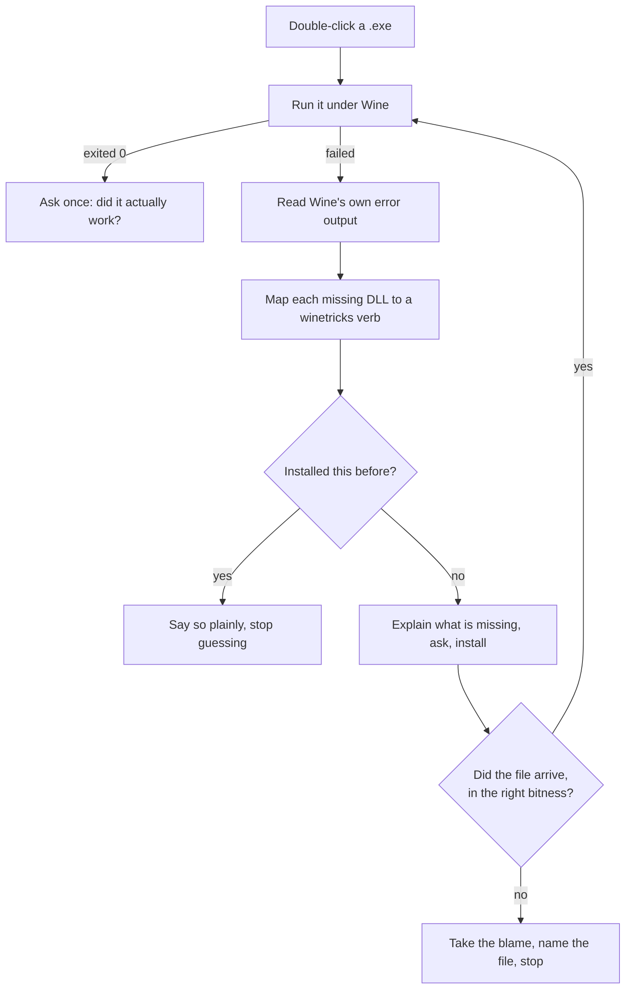

<div align="center">

# Tandem

### Double-click a file. It runs.

**`.exe` · `.msi` · `.apk` · `.xapk` on Linux — without a terminal, without a tutorial, without you learning what a `winetricks` verb is.**

[](https://github.com/ChrnX0/Tandem/actions/workflows/ci.yml)
[](tests/run.sh)
[](https://lintian.debian.org/)
[](build.py)
[](LICENSE)

**[Português](LEIAME.md)** · [Contributing](CONTRIBUTING.md) · [Idea ledger](docs/IDEAS.md) · [List format](docs/LIST-FORMAT.md)


</div>

---

## The difference, in one glance

<table>
<tr>
<th width="50%">Getting a Windows program running today</th>
<th width="50%">With Tandem</th>
</tr>
<tr>
<td>

```console
$ sudo apt install wine winetricks
$ WINEPREFIX=~/.wine-app winecfg
$ wine setup.exe
0024:err:module:import_dll Library
MSVCP140.dll not found
$ # ...which package is that?
$ # (opens forum, reads 40 replies)
$ winetricks -q vcrun2019
$ wine setup.exe
0024:err:module:import_dll Library
VCRUNTIME140_1.dll not found
$ # (back to the forum)
```

</td>
<td>

<br>

### Double-click it.

<br>

If something is missing, Tandem finds it, names it in a sentence you can act on, asks once, and installs it.

If it *cannot* work, it says that too — **before** you spend half an hour downloading.

<br>

</td>
</tr>
</table>

---

## What makes it different

Wine, Bottles, Lutris and PlayOnLinux all run Windows programs, and they do it well. What none of them do is **close the diagnostic loop for someone who cannot read a log**. That is the whole of Tandem.

### 🔁 It reads Wine's own error output and acts on it

When a program fails, Wine prints `err:module:import_dll Library MSVCP140.dll not found`. Tandem parses those lines, maps each DLL to the `winetricks` package that provides it, installs, and retries — the loop an experienced person performs by hand.



### 🧾 Finishing is not the same as working

`winetricks` exiting `0` means **it** finished, not that the missing file arrived. Tandem checks that the DLL is really there — *and in the right bitness*. A 64-bit program cannot load a 32-bit DLL out of `syswow64`, and a large share of `winetricks` verbs ship 32-bit payloads only.

When that is the situation, you hear about it **before** the download:

<div align="center">

</div>

### 🙋 It takes the blame when the blame is its

*"I installed the dependencies and it still does not open"* sends a shop owner hunting for a defect in a machine that is perfectly fine. Tandem names the file that is still missing and says whose problem it is:

<div align="center">

</div>

### 🔇 No error path ends in silence

"I double-clicked and nothing happened" is treated as a **bug**, not a limitation. Every failure ends in a window; with no graphical session, on the terminal; always in the log. That rule has already caught an error dialog that never opened, a progress bar that killed the whole program, and a redirect that silenced the program's own output.

### 🔒 It will not touch a Wine prefix it did not create

A prefix Tandem did not make is **read-only to the automation**. If your program lives in one, Tandem runs it *there*, reports what is missing, and **stops**.

> This exists because the project was born on a machine that also runs a point-of-sale system in its own prefix. Automation that "helpfully" installs a runtime into a working production environment is worse than no automation.

```bash
tandem protect ~/.wine-pos     # mark any prefix untouchable, explicitly
```

---

## Install

Download the `.deb` from **[Releases](../../releases/latest)** and double-click it. Or, from a terminal:

```bash
curl -LO https://github.com/ChrnX0/Tandem/releases/latest/download/tandem_3.6_all.deb
sudo apt install ./tandem_3.6_all.deb
```

<details>
<summary>Building it yourself instead, and checking what you downloaded</summary>

<br>

The build is reproducible: the `.deb` attached to the release is byte-for-byte identical to the one you get from this repository, so you can verify rather than trust. No Debian host and no `dpkg-deb` needed — the packager writes the `ar` archive itself, on any OS.

```bash
git clone https://github.com/ChrnX0/Tandem && cd Tandem
python3 build.py --check
sha256sum tandem_3.6_all.deb          # compare with the .sha256 on the release
```

Every release is built by the workflow in [`.github/workflows/release.yml`](.github/workflows/release.yml), which runs the suite and `lintian`, then really installs, configures and purges the package on Ubuntu 24.04 — and only publishes if all of that passes.

</details>

Then let Tandem set up whatever is missing:

```bash
tandem preparar
```

<details>
<summary>What <code>tandem preparar</code> actually does, and why it is a separate command</summary>

<br>

It installs Wine, `winetricks`, 32-bit support, `adb` and Waydroid — including the Waydroid repository and its signing key, in the right order — and asks for your password once.

This cannot happen while the `.deb` installs: `dpkg` holds a lock during `postinst`, and an `apt-get` in there would wait forever. Double-clicking a `.exe` with no Wine present also offers to install it on the spot, because that is the moment you actually want it solved.

</details>

### Requirements

| For | You need |
|---|---|
| Windows programs, 64-bit | `wine` — the normal case, nothing else |
| Windows programs, 32-bit | also `wine32` (`sudo dpkg --add-architecture i386`) |
| Automatic dependencies | `winetricks` |
| Android apps | [`waydroid`](https://docs.waydro.id/), initialised |
| Split packages (`.xapk`) | `adb` |
| ARM-only apps on x86 | [libhoudini / libndk](https://github.com/casualsnek/waydroid_script) |

Tested on Zorin OS 18.1 and Ubuntu 24.04. Should work on any Debian-based distribution with a freedesktop-compliant desktop.

---

## Android, too

- **It inspects the package before installing.** A bundled binary-XML parser — no Android SDK required — reads the package name, `minSdkVersion` and the native ABIs and compares them with the running Android. You are told *"this app needs Android 15, yours is 13"* instead of watching an install fail.
- **It handles split packages.** `.xapk`, `.apks` and `.apkm` are extracted and installed through ADB with `install-multiple`, OBB data included. Most large apps ship this way and a plain installer cannot cope.
- **It reads the real result.** `waydroid app install` exits `0` even when it fails. Tandem parses the output and turns `NO_MATCHING_ABIS` into *"this app is built for phones only and will not run here."*
- **It waits for the right signal.** `Session: RUNNING` means the session manager started, not that Android booted. Tandem waits for `sys.boot_completed`.

---

## Commands

You mostly will not need these — you double-click files. When you do want the command line:

| | |
|---|---|
| `tandem` | the panel |
| `tandem install <file>` | install or run anything |
| `tandem preparar` | install what is missing (Wine, Android, …) |
| `tandem programas` | list and open installed Windows programs |
| `tandem desinstalar` | remove an installed Windows program |
| `tandem android` | open the Android screen |
| `tandem doctor` | environment diagnosis — what **exists** |
| `tandem autoteste` | exercise it here — what **works** |
| `tandem repair` | re-apply file associations |
| `tandem dados` | show **your** files inside Windows |
| `tandem backup` · `tandem restore` | save and restore the whole environment |
| `tandem protect <path>` | mark a Wine prefix untouchable |
| `tandem alternativas <name>` | find a Linux program that does the same job |
| `tandem receita <file>` | export what it learned, to send to someone |
| `tandem memoria` · `tandem esquecer <name>` | see and clear what it learned |
| `tandem lista` · `tandem contribuir <file>` | the community list, both directions |
| `tandem socorro` | one file with everything, to ask for help |
| `tandem logs` | the latest log |

---

## Three ideas worth the read

### 💾 Your data is not your environment

The environment — the prefix, the runtimes, the programs — Tandem rebuilds in twenty minutes. What you *typed into* those programs, it cannot.

Nothing in this project separated the two until version 3.4, and three code paths were deleting user data with no copy. `tandem dados` finds what is yours (Windows user folders, plus the `.mdb`/`.fdb`/`.dbf` files that commercial software drops next to its own executable) and copies just that — small enough to fit in an email.

```bash
tandem dados            # what is mine in here, and how big?
tandem dados salvar     # copy only that
tandem dados restaurar  # put it back, never overwriting
```

> **The promise this exists to keep:** *if you give up on Linux, your data comes back with you.*

### 🧠 It remembers, and it never lies about how sure it is

Tandem records what each program needed, keyed by a fingerprint of the **file** — size plus first and last MiB — so the lesson survives moving folders and holds on someone else's machine.

But `exit 0` is not proof. Wine's characteristic failure with commercial software is **opening and being subtly wrong**: a receipt with broken accents, a blank report, a reversed date. So Tandem asks you, once per program, whether it actually worked — and every lesson it exports is stamped with where its confidence came from. "A person looked at the screen" weighs differently from "the process exited 0".

### 🌐 A community list, not a server

`tandem lista` fetches a plain-text file over HTTPS — the ad-blocker filter-list model. No API, no account, no uptime to pay for; that is why EasyList has survived twenty years on a volunteer's budget.

**Reading is automatic. Publishing is not.** `tandem contribuir` builds the line and shows it to you in full — *you* send it. The line carries a fingerprint of the file, the architecture and the components that fixed it, and **nothing else**: no filename, no path, no username, no machine name, no IP, no logs. The generator refuses to produce it if any of those appear. [Full format →](docs/LIST-FORMAT.md)

---

## What will never work

Being honest about this up front saves everyone an afternoon.

| | Why |
|---|---|
| **USB devices inside Android** | Waydroid has no USB passthrough. Thermal printers, card readers, barcode scanners and scales do not exist inside the container. No automation changes this. |
| **Banking and payment apps** | Play Integrity detects the container. There is no reliable workaround. |
| **Windows software with kernel drivers** | Anti-cheat, some POS payment middleware, hardware dongles. Wine runs in user space. |
| **Hardware-locked licensing** | Wine reports empty or synthetic BIOS and disk serials. Software that fingerprints the machine may refuse to activate — or crash on the activation screen. |

Tandem recognises several of these from the executable itself, **before running it**, and explains the failure instead of showing you an exit code.

---

## Contributing

**The most valuable contribution does not require code.**

Tandem has an honest problem: almost no real commercial program has ever run on it. The dependency loop has been exercised with real Wine and real `winetricks` — but against binaries built for the test, not against a shop's point-of-sale system on a counter. Every report about a real program is worth more than a new feature.

| It worked | It failed |
|---|---|
| `tandem contribuir <file>` builds an anonymous line — [paste it into an issue](../../issues/new?template=list.yml) | `tandem socorro` bundles everything a maintainer would ask for into one file — [open an issue](../../issues/new?template=did-not-work.yml) |

The five rules that do not bend, and the evidence bar that "done" has to clear, are in **[CONTRIBUTING.md](CONTRIBUTING.md)**. Before proposing a feature, look at **[docs/IDEAS.md](docs/IDEAS.md)** — 52 ideas with a verdict each, and the rejected ones carry the written reason.

<details>
<summary><b>Build and test</b></summary>

<br>

```bash
python3 build.py --check   # packages; no Debian host, no dpkg-deb
bash tests/run.sh          # 309 tests; no Wine, no Waydroid, no install
```

The suite sources the shell libraries straight from `src/lib` and synthesises Android packages including a real binary `AndroidManifest.xml`, so the manifest parser runs on the same code path a real APK takes. Optional tools (`shellcheck`, `dpkg-deb`, `desktop-file-validate`) are used when present and skipped when absent, so it passes on a bare machine.

CI additionally runs `lintian` with zero warnings, checks the build is byte-for-byte reproducible, and performs a real install–configure–purge cycle on Ubuntu 24.04.

</details>

---

<div align="center">

**MIT** · [LICENSE](LICENSE)

<sub>Built for a shop owner who is not a programmer, and judged by one rule:<br>no error path may end in silence.</sub>

</div>
