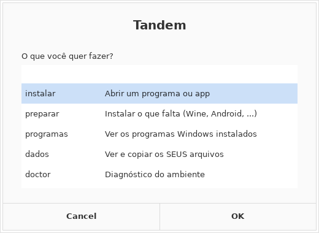
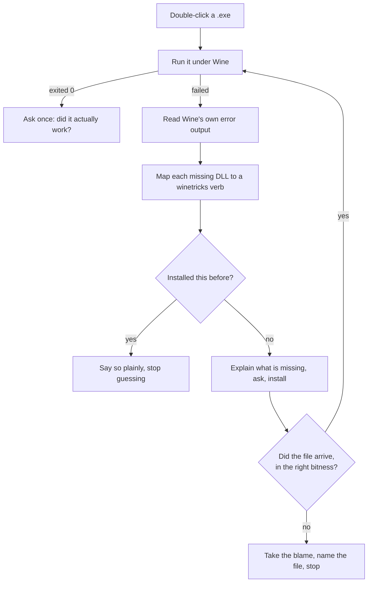
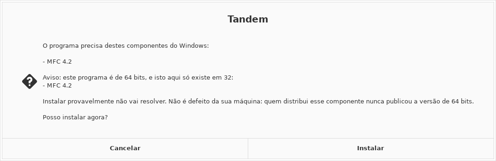
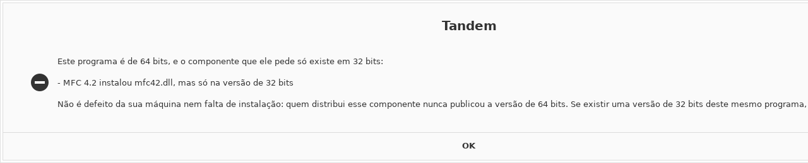

<div align="center">

# Tandem

### Double-click a file. It runs.

**Nine formats. `.exe` `.msi` · `.apk` `.xapk` · `.AppImage` `.jar` · `.deb` `.rpm` `.flatpakref` `.snap` — without a terminal, without a tutorial, without you learning what a `winetricks` verb is.**

[](https://github.com/ChrnX0/Tandem/actions/workflows/ci.yml)
[](tests/run.sh)
[](https://github.com/ChrnX0/Tandem/actions/workflows/real-programs.yml)
[](https://lintian.debian.org/)
[](build.py)
[](LICENSE)

**[Português](LEIAME.md)** · [Contributing](CONTRIBUTING.md) · [Idea ledger](docs/IDEAS.md) · [List format](docs/LIST-FORMAT.md)



</div>

---

## The difference, in one glance

<table>
<tr>
<th width="50%">Getting a Windows program running today</th>
<th width="50%">With Tandem</th>
</tr>
<tr>
<td>

```console
$ sudo apt install wine winetricks
$ WINEPREFIX=~/.wine-app winecfg
$ wine setup.exe
0024:err:module:import_dll Library
MSVCP140.dll not found
$ # ...which package is that?
$ # (opens forum, reads 40 replies)
$ winetricks -q vcrun2019
$ wine setup.exe
0024:err:module:import_dll Library
VCRUNTIME140_1.dll not found
$ # (back to the forum)
```

</td>
<td>

<br>

### Double-click it.

<br>

If something is missing, Tandem finds it, names it in a sentence you can act on, asks once, and installs it.

If it *cannot* work, it says that too — **before** you spend half an hour downloading.

<br>

</td>
</tr>
</table>

---

## What makes it different

Wine, Bottles, Lutris and PlayOnLinux all run Windows programs, and they do it well. What none of them do is **close the diagnostic loop for someone who cannot read a log**. That is the whole of Tandem.

<details>
<summary>That claim was checked against the field, and one half of it turned out to be wrong</summary>

<br>

**Bottles detects.** Since release 61 (January 2026) it ships an analysis engine called *Eagle* — 1145 lines of `pefile` + 67 YARA rules + a 6.3 MB intelligence database — which reads an unknown `.exe`'s import table and **names the runtimes it needs**, with nobody picking from a list. It even extracts an MSI or Inno installer to a sandbox to analyse the binaries that *will* be installed, which is more than Tandem's `peinfo.py` does. An earlier version of this project's notes claimed nobody did automatic detection. That was wrong, and it is corrected in `CLAUDE.md` with the evidence.

**Nobody closes the loop.** Eagle proposes and stops: the dependency suggestions render as a non-interactive row, and the human installs by hand. A GitHub code search for `"winetricks" "import_dll" language:python` returns **two** files on all of GitHub — one abandoned in 2018, one with a fix table of three entries behind a log window and a button. `import_dll` returns zero hits in Bottles, Lutris, Heroic, PortProton, Faugus, umu-launcher and ProtonUp-Qt. PortProton and umu-protonfixes *do* install without asking — because a human already chose, per game, across 204 database files and 477 hand-written scripts keyed by Steam AppID. For a program nobody has written a recipe for, there is no answer anywhere.

Three more things the search found nobody doing, each of which Tandem does:

- **Verifying the file arrived.** `winetricks` has 568 verbs and 19 verification functions — all `dotnet*`, all behind an opt-in flag. Bottles has no post-install existence check at all.
- **Comparing the delivered DLL's bitness with the program's.** `winetricks` knowingly installs 32-bit payloads into `syswow64` of a 64-bit prefix and never compares. Bottles and PortProtonQt both read the PE machine field and only print it.
- **Remembering by file identity.** Every scheme found keys on a store ID or a filename, so the lesson dies when the file moves and never transfers to another machine.

And on the AppImage side, the honest scorecard: the execute bit is solved by three projects in three different ways, and menu integration is solved well by two. The automatic FUSE fallback, the truncated-download verdict, the `noexec` diagnosis and the GLIBC-too-old explanation were found in **none** of them.

</details>

### 🔁 It reads Wine's own error output and acts on it

When a program fails, Wine prints `err:module:import_dll Library MSVCP140.dll not found`. Tandem parses those lines, maps each DLL to the `winetricks` package that provides it, installs, and retries — the loop an experienced person performs by hand.



### 🧾 Finishing is not the same as working

`winetricks` exiting `0` means **it** finished, not that the missing file arrived. Tandem checks that the DLL is really there — *and in the right bitness*. A 64-bit program cannot load a 32-bit DLL out of `syswow64`, and a large share of `winetricks` verbs ship 32-bit payloads only.

When that is the situation, you hear about it **before** the download:

<div align="center">

</div>

### 🙋 It takes the blame when the blame is its

*"I installed the dependencies and it still does not open"* sends a shop owner hunting for a defect in a machine that is perfectly fine. Tandem names the file that is still missing and says whose problem it is:

<div align="center">

</div>

### 🔇 No error path ends in silence

"I double-clicked and nothing happened" is treated as a **bug**, not a limitation. Every failure ends in a window; with no graphical session, on the terminal; always in the log. That rule has already caught an error dialog that never opened, a progress bar that killed the whole program, and a redirect that silenced the program's own output.

### 🔒 It will not touch a Wine prefix it did not create

A prefix Tandem did not make is **read-only to the automation**. If your program lives in one, Tandem runs it *there*, reports what is missing, and **stops**.

> This exists because the project was born on a machine that also runs a point-of-sale system in its own prefix. Automation that "helpfully" installs a runtime into a working production environment is worse than no automation.

```bash
tandem protect ~/.wine-pos     # mark any prefix untouchable, explicitly
```

---

## Install

Download the `.deb` from **[Releases](../../releases/latest)** and double-click it. Or, from a terminal:

```bash
curl -LO https://github.com/ChrnX0/Tandem/releases/latest/download/tandem_3.8_all.deb
sudo apt install ./tandem_3.8_all.deb
```

<details>
<summary>Building it yourself instead, and checking what you downloaded</summary>

<br>

The build is reproducible: the `.deb` attached to the release is byte-for-byte identical to the one you get from this repository, so you can verify rather than trust. No Debian host and no `dpkg-deb` needed — the packager writes the `ar` archive itself, on any OS.

```bash
git clone https://github.com/ChrnX0/Tandem && cd Tandem
python3 build.py --check
sha256sum tandem_3.8_all.deb          # compare with the .sha256 on the release
```

Every release is built by the workflow in [`.github/workflows/release.yml`](.github/workflows/release.yml), which runs the suite and `lintian`, then really installs, configures and purges the package on Ubuntu 24.04 — and only publishes if all of that passes.

</details>

Then let Tandem set up whatever is missing:

```bash
tandem preparar
```

<details>
<summary>What <code>tandem preparar</code> actually does, and why it is a separate command</summary>

<br>

It installs Wine, `winetricks`, 32-bit support, `adb`, Java, the FUSE library and Waydroid — including the Waydroid repository and its signing key, in the right order — and asks for your password once.

This cannot happen while the `.deb` installs: `dpkg` holds a lock during `postinst`, and an `apt-get` in there would wait forever. Double-clicking a `.exe` with no Wine present also offers to install it on the spot, because that is the moment you actually want it solved.

</details>

### Requirements

| For | You need |
|---|---|
| Windows programs, 64-bit | `wine` — the normal case, nothing else |
| Windows programs, 32-bit | also `wine32` (`sudo dpkg --add-architecture i386`) |
| Automatic dependencies | `winetricks` |
| Android apps | [`waydroid`](https://docs.waydro.id/), initialised |
| Split packages (`.xapk`) | `adb` |
| `.jar` programs | `java` — `default-jre` |
| `.AppImage`, at full speed | `libfuse2t64` (without it Tandem unpacks instead, and says so) |
| `.deb` packages | nothing — `apt` and `dpkg` are already there |
| `.flatpakref` | `flatpak` — Tandem offers to install it when a file needs it |
| `.snap` | `snapd` |
| ARM-only apps on x86 | [libhoudini / libndk](https://github.com/casualsnek/waydroid_script) |

Tested on Zorin OS 18.1 and Ubuntu 24.04. Should work on any Debian-based distribution with a freedesktop-compliant desktop.

---

## Android, too

- **It inspects the package before installing.** A bundled binary-XML parser — no Android SDK required — reads the package name, `minSdkVersion` and the native ABIs and compares them with the running Android. You are told *"this app needs Android 15, yours is 13"* instead of watching an install fail.
- **It handles split packages.** `.xapk`, `.apks` and `.apkm` are extracted and installed through ADB with `install-multiple`, OBB data included. Most large apps ship this way and a plain installer cannot cope.
- **It reads the real result.** `waydroid app install` exits `0` even when it fails. Tandem parses the output and turns `NO_MATCHING_ABIS` into *"this app is built for phones only and will not run here."*
- **It waits for the right signal.** `Session: RUNNING` means the session manager started, not that Android booted. Tandem waits for `sys.boot_completed`.

---

## The formats Linux uses itself

Five of them fail on a double click for reasons that have nothing to do with Wine, and everything to do with Linux. Tandem treats them the same way it treats an `.exe`: read the file first, explain in a sentence, fix what can be fixed.

On the machine this project was born on, `.deb`, `.rpm` and `.snap` had **no owner at all** — not a bad message being improved, a vacuum. `.flatpakref` is worse than a vacuum: it is declared a subclass of `text/plain`, so a double click hands it to a **text editor**, which opens four lines of INI and explains nothing. And `.deb` on Zorin is not empty either — Zorin's own documentation tells you to double-click it and get the Software store, so that is a dispute, exactly like `.exe`.

<details>
<summary>This paragraph used to say all four were a vacuum, and the instrument was wrong</summary>

<br>

The claim came from `xdg-mime query default`, which answers nothing for all four. But **Nautilus does not use `xdg-mime`** — it uses GIO, and GIO resolves the MIME **subclass chain** while `xdg-mime` does not. Proven on a type Tandem never touches: `gio mime text/sgml` answers `vim.desktop`; `xdg-mime query default text/sgml` answers nothing at all. So the tool used to measure the vacuum could not see the handler that was there.

There is a second incumbent, and it ships on the reference machine: **`zorin-exec-guard`**, two `NoDisplay=true` handlers claiming `.exe/.msi/.msix` and `.deb/.AppImage`, backed by a database of 240+ apps translated into 90 languages, pt_BR included. It matches installer filenames with regexes and suggests a native alternative — it never runs anything, never diagnoses and never fixes. Tandem is not entering a vacuum on Zorin; it is entering a four-way dispute where the incumbent's Portuguese is already written.

</details>

### `.AppImage` — one file, no install, and a double click that does nothing

An AppImage arrives from the browser **without the execute bit**, and a file without that bit is not offered to the system as a program at all. The click opens an archive manager, or nothing happens, and the file gets blamed. Tandem sets the bit — you double-clicked it, you have already said you want to run it.

Then the failures that come after, each read off the file before anything runs:

| What is wrong | What you are told |
|---|---|
| The download was cut short | *"the download of this file did not finish"* — the payload header says how big it should be, and the file is shorter |
| Built for another processor | *"it is for `aarch64` and this computer is `x86_64`"* |
| FUSE is missing | nothing — Tandem **works around it**, unpacking instead of mounting, then tells you the one-line fix to make it fast |
| Built on a newer distribution | *"this program is newer than your Linux"*, with the GLIBC it wants — and that no amount of installing will fix it |
| On a pen drive mounted `noexec` | *"the folder does not allow running anything; copy it to your home folder"* |

It also puts the program **in your applications menu**, using the desktop entry the AppImage carries inside itself. Extraction does not mount anything, so that works on exactly the machines that have no FUSE. If you later delete the file, the menu entry deletes itself.

> The payload offset Tandem computes from the ELF header is the same number the AppImage runtime's own `--appimage-offset` prints by running itself — checked against it, weekly, in CI.

### `.jar` — Java answers in numbers nobody can act on

Two failures cover almost all of them, and Java describes both in words the person clicking has no way to use.

**`no main manifest attribute`** means the file is a *piece* of a program, not a program. The two kinds of `.jar` are indistinguishable from the outside — same extension, same icon — so you cannot know you downloaded the wrong one. Tandem reads the manifest and says so.

**`UnsupportedClassVersionError: class file version 65.0`** means it needs a newer Java. The number on the download page is `21`. They differ by 44. Tandem does that subtraction, **before running anything**, and offers to install the version the program asks for:

```
Este programa precisa de uma versão mais nova do Java.

Ele pede o Java 22 e o instalado aqui é o 21.

Para instalar a versão que ele pede:

sudo apt install openjdk-22-jre
```

Classes under `META-INF/versions/` are deliberately excluded from that calculation — they exist so a *newer* Java can pick them up, and counting them would demand a Java the program does not need. That claim is checked against a real JVM in CI: a jar is compiled, its version bumped by one, and the JVM has to refuse it with exactly the number Tandem predicted.

It also unfolds the manifest's 72-byte line wrapping before checking a `Class-Path`, because a wrapped one splits file names down the middle — and reports the **file** that is missing rather than the class name Java would have named.

### `.deb` — your own system's format, and the worst message of the lot

A `.deb` from a website is the commonest thing a Linux beginner downloads, and the commonest way it fails. Here is what Ubuntu 24.04 actually says when the package was built for an older release — copied off a terminal, not paraphrased:

```
programa-antigo : Depends: libssl1.1 but it is not installable
E: Unable to correct problems, you have held broken packages.
```

You held nothing. You downloaded the file the website offered you. And the one thing you needed to know — *this was built for a different version of your system; go back and pick the other one* — is in neither line.

Tandem says that instead. **And it says it before asking for your password**, because `apt-get install -s` answers unprivileged: there is no reason to make somebody type a password to be told no.

| What is wrong | What you are told |
|---|---|
| Built for another release | *"this program was made for a different version of your system"*, with the components named, and that there is nothing to try |
| Needs a repository you don't have | *"look at the website's instructions"* — a different verdict, and it is the **name** that separates them: a library with a release welded into it (`libssl1.1`, `libicu70`) will never install here; a plain program name will |
| Built for another processor | *"it is for `arm64` and this computer is `amd64`"* |
| Would **remove** other programs | the list, and a question — this is the one path that can do real damage |
| An older version than you have | a question, with dpkg deciding which is newer, because Debian version ordering has rules a string comparison gets wrong |
| The download was cut short | *"the download did not finish"* |
| Another install is already running | *"the computer is already installing something else — wait a minute"*, instead of `Could not get lock /var/lib/dpkg/lock-frontend` |

> Every current Ubuntu `.deb` uses `control.tar.zst`, which Python cannot read and for which neither the `zstd` command nor `python3-zstandard` is installed by default. Tandem reads it through `libzstd` directly — the library `dpkg` itself pre-depends on, so on any machine where a `.deb` means anything, it is there by construction.

### `.rpm` — a dead end, answered with the way out

An `.rpm` will not install on a Debian-based system, and today nothing says so: no handler owns the type, so the double click does nothing. Tandem reads the name, version and distribution out of the header — no `rpm` needed — and then does the useful thing: **looks for the same program in your own repositories.**

```
Este arquivo é um pacote de outra família de Linux.
Este aqui foi feito por: Fedora Project

A boa notícia: o mesmo programa está no seu próprio sistema. Para instalar:

sudo apt install hello
```

**Converting it with `alien` is deliberately not offered.** A converted package carries dependency names that do not exist here and skips the scripts that set the program up — it produces something that *looks* installed and is not, which is the exact failure this project exists to prevent.

### `.flatpakref` · `.snap` — and one honest warning

A `.flatpakref` installs for your user, no password. A `.flatpakrepo` adds a **source** and installs nothing, and is described in those words rather than dressed up as an application.

A loose `.snap` can only be installed with a flag literally named `--dangerous`, because it carries no signature the system can check. Tandem tells you that, in your language, before using it. A tool that passes `--dangerous` quietly is making that decision on your behalf.

### `.sh` · `.run` — the one case where the answer is *not* to run it

A script does anything its author wants, including deleting everything you have. So this handler splits by what the file actually is: a vendor installer (makeself, a megabyte of payload behind a shell header) is *meant* to be run and gets that offer; a small plain script gets offered **as text first**, because that is almost certainly what you want with a file you just downloaded.

And `application/x-shellscript` is the one type `tandem repair` deliberately **does not claim**. Opening a downloaded script in a text editor is a defensible default, and Tandem does not take a type away from a handler that is already doing the right thing. It stays reachable through "Open with" and `tandem install`.

---

## Commands

You mostly will not need these — you double-click files. When you do want the command line:

| | |
|---|---|
| `tandem` | the panel |
| `tandem install <file>` | install or run anything |
| `tandem preparar` | install what is missing (Wine, Java, Android, …) |
| `tandem programas` | list and open installed programs, Windows and AppImage |
| `tandem desinstalar` | remove an installed Windows program |
| `tandem android` | open the Android screen |
| `tandem doctor` | environment diagnosis — what **exists** |
| `tandem autoteste` | exercise it here — what **works** |
| `tandem repair` | re-apply file associations |
| `tandem dados` | show **your** files inside Windows |
| `tandem backup` · `tandem restore` | save and restore the whole environment |
| `tandem protect <path>` | mark a Wine prefix untouchable |
| `tandem idioma [code]` | which language Tandem speaks — `pt_BR` `en` `es` `fr` `zh_CN` `hi` `ar` |
| `tandem identidade` | what a program reads about this machine when it locks a licence to it |
| `tandem portas` | which COM the pinpad, scale or printer landed on — and how to move it |
| `tandem alternativas <name>` | find a Linux program that does the same job |
| `tandem receita <file>` | export what it learned, to send to someone |
| `tandem memoria` · `tandem esquecer <name>` | see and clear what it learned |
| `tandem lista` · `tandem contribuir <file>` | the community list, both directions |
| `tandem enviar [sim\|nao]` | send what it learns automatically — **on**, and announced at install |
| `tandem socorro` | one file with everything, to ask for help |
| `tandem logs` | the latest log |

---

## Three ideas worth the read

### 💾 Your data is not your environment

The environment — the prefix, the runtimes, the programs — Tandem rebuilds in twenty minutes. What you *typed into* those programs, it cannot.

Nothing in this project separated the two until version 3.4, and three code paths were deleting user data with no copy. `tandem dados` finds what is yours (Windows user folders, plus the `.mdb`/`.fdb`/`.dbf` files that commercial software drops next to its own executable) and copies just that — small enough to fit in an email.

```bash
tandem dados            # what is mine in here, and how big?
tandem dados salvar     # copy only that
tandem dados restaurar  # put it back, never overwriting
```

> **The promise this exists to keep:** *if you give up on Linux, your data comes back with you.*

### 🧠 It remembers, and it never lies about how sure it is

Tandem records what each program needed, keyed by a fingerprint of the **file** — size plus first and last MiB — so the lesson survives moving folders and holds on someone else's machine.

But `exit 0` is not proof. Wine's characteristic failure with commercial software is **opening and being subtly wrong**: a receipt with broken accents, a blank report, a reversed date. So Tandem asks you, once per program, whether it actually worked — and every lesson it exports is stamped with where its confidence came from. "A person looked at the screen" weighs differently from "the process exited 0".

### 🌐 A community list, not a server

`tandem lista` fetches a plain-text file over HTTPS — the ad-blocker filter-list model. No API, no account, no uptime to pay for; that is why EasyList has survived twenty years on a volunteer's budget.

**Reading is automatic. Publishing is not.** `tandem contribuir` builds the line and shows it to you in full — *you* send it. The line carries a fingerprint of the file, the architecture and the components that fixed it, and **nothing else**: no filename, no path, no username, no machine name, no IP, no logs. The generator refuses to produce it if any of those appear. [Full format →](docs/LIST-FORMAT.md)

---

## What will never work

Being honest about this up front saves everyone an afternoon.

| | Why |
|---|---|
| **Shop hardware inside Android** | **Your barcode scanner already works** — it is a keyboard, and Waydroid gets its keystrokes from the compositor like any other. For a thermal printer, a pinpad or a scale, nobody anywhere has ever reported one working inside Waydroid, and Tandem will not send you down that road. Keep them on Linux, where all four are better supported than in the container — `tandem alternativas` shows how. |
| **Windows software that ships a kernel driver** | Wine loads a `.sys` with `LoadLibraryExW` into `winedevice.exe`, an ordinary user process, and the hardware calls underneath are stubs: `MmMapIoSpace` returns NULL, port I/O returns zeros. Kernel anti-cheat is the clean case — and the EAC/BattlEye exception is a switch the **game's developer** flips, not you. **Needing hardware is a different thing, and usually fine** — see the row below. |
| **Play Integrity, for banking and payment apps** | Not "it detects the container" — it fails to find something a container cannot have. Hardware attestation needs a key burned into a real phone's secure element; Waydroid has no secure element to burn one into. Brazilian banks refuse on their own root detection before Google is even asked. |

Tandem recognises several of these from the executable itself, **before running it**, and explains the failure instead of showing you an exit code.

### And two things that were on this list until 4.0, wrongly

Both were checked against primary sources. Both moved.

| | What is actually true |
|---|---|
| **Hardware keys (dongles)** | **A Sentinel HL or SL key works.** Thales publishes [Supporting Protected Applications Under Wine](https://docs.sentinel.thalesgroup.com/ldk/LDKdocs/GSG/GSG_Linux_HTML/GSG_Guides/Linux/Support_under_Wine.htm) — both key types *"have been tested"*, on **Wine 10.0**, once the Sentinel Linux Run-time Environment is installed. The Windows side never touches the key: `aksusbd` owns it on Linux and the program reaches the licence manager over the local network. **HASP4 and Hardlock do not work** — the vendor excludes them by name. Tandem now tells the two apart from the import table and answers with the right one of the two. |
| **Hardware-locked licensing** | **Usually works.** Since Wine 3.13 the manufacturer, model, BIOS, board, CPU, RAM and MAC a program reads are your real machine's, out of `/sys/class/dmi/id`. The real failure is not being refused — it is **losing** an activation later, because the C: volume serial and `MachineGuid` are invented at random *per prefix* and change when the environment is rebuilt. Tandem derives both from this machine and freezes them at creation, so a rebuilt environment comes back as the same computer. Run `tandem identidade` to see every identifier and where each one comes from. |

**Where the line is.** Tandem stabilises an identity and explains what the software sees. It does not forge one. It will never invent a Windows ProductId, and it will never fake the DMI table — [that spoof works](docs/IDEAS.md), which is exactly why it is refused on the record.

<details>
<summary>What the dongle row used to say, and what checking it cost</summary>

<br>

It read: *"Anti-cheat, some POS payment middleware, hardware dongles. Wine runs in user space."* The mechanism was right and the examples were wrong, in a way that is worse than being vague.

- **The row conflated two different things.** "The program ships a kernel driver" and "the program needs hardware" are not the same claim. Wine maps serial, USB-serial and parallel ports (`/dev/ttyS*`, `/dev/ttyUSB*`, `/dev/ttyACM*`, `/dev/lp*`), exposes every HID device, backs WinUSB with libusb, and forwards smartcards straight to PC/SC. A point-of-sale program talking to a pinpad has no ring-0 problem to begin with.
- **"Hardware dongles" was false for the largest family on the market**, and the manufacturer's own documentation says so, for the exact Wine version on the reference machine.
- **The Brazilian TEF examples were wrong too.** CliSiTef ships `libclisitef.so`, PayGo ships `PGWebLib.so` in 32 and 64-bit, ACBrLib compiles to `.so`. None of them is a kernel driver. Tandem now recognises those imports and says the honest thing: *the library your system already uses has a Linux version — ask your supplier*, because only the supplier can act on it.

**What survives:** a real third-party `.sys` that touches I/O ports, MMIO or interrupts is a dead end, and the dangerous part is not the verdict — it is that such a driver often **loads** and returns zeros, so the program starts and then misbehaves in a way that looks like its own bug. Wine prints `fixme:ntoskrnl:MmMapIoSpace stub` and `fixme:hal:READ_PORT_UCHAR stub!` when that happens. Since 4.0 Tandem reads those lines and turns them into a sentence — and had to re-enable the two debug channels by name, because the setting that keeps the log readable was switching off the evidence.

</details>

<details>
<summary>The licensing row said "empty or synthetic serials", and that was measured false</summary>

<br>

Measured on Wine, unprivileged, with a bind-mounted `/sys/class/dmi/id`: `SystemManufacturer=Dell Inc.`, `SystemProductName=OptiPlex 3070`, `BaseBoardProduct=0K240Y`, `BIOSVersion=2.21.0` — the real values, and `wmic` agreed. CPU ID and CPU name matched `/proc/cpuinfo` byte for byte.

- **Exactly four DMI fields are degraded**, and only because the Linux kernel keeps them at mode `0400`: the product, board and chassis serials and the product UUID. Wine substitutes an identifier derived from `machine-id` — stable across reboots and unique per machine, which is what a fingerprint needs.
- **Three values genuinely are constants**, shared by every Wine install on Earth: the WMI BIOS serial (`Serial number`), the disk serial (`WINEHDISK`) and the default ProductId. If a licence check refuses, it almost certainly saw one of those. `tandem identidade` names them so the owner can put it in a ticket to their own vendor.
- **Two dead ends, both measured, so nobody rediscovers them.** Editing `HKLM\HARDWARE\DESCRIPTION\System\BIOS` looks like it worked and is gone at the next launch — the key is created `REG_OPTION_VOLATILE` — and even while it is live it never reaches WMI, which calls `GetSystemFirmwareTable` directly. There is no environment variable or winecfg option that overrides SMBIOS data; searching for one and finding nothing is the whole result.

</details>

<details>
<summary>The first row used to say something stronger, and checking it showed the mechanism was wrong</summary>

<br>

It read: *"Waydroid has no USB passthrough. Thermal printers, card readers, barcode scanners and scales do not exist inside the container. No automation changes this."* The **advice** was sound. Every **mechanism claim** in it was false, and one of the four devices was flatly wrong.

- **Waydroid denies no devices.** Its LXC configuration contains no `lxc.cgroup.devices.deny` line at all. The container has kernel access; what is missing is elsewhere.
- **The real barrier is one missing declaration.** AOSP only instantiates `UsbHostManager` when the platform declares `android.hardware.usb.host`, and Waydroid's image does not. So `getDeviceList()` returns empty regardless of what exists under `/dev`. Waydroid also ships `persist.waydroid.uevent`, a maintainer-authored feature described as *"allow android direct access to hotplugged devices"*. People have enabled both and driven real USB devices.
- **A barcode scanner needs none of that.** It is a USB HID keyboard; its keystrokes arrive through the Wayland compositor with zero configuration. Waydroid's known problem here is the opposite of the one claimed — it can type each code **twice** ([issue #778](https://github.com/waydroid/waydroid/issues/778)). Telling that owner their scanner cannot work sends them to buy hardware they already own.

**What survives, and it is why the row stays:** nobody, in any language, has reported a thermal printer, a pinpad or a scale working inside Waydroid. The route exists on paper and nobody has walked it, so Tandem describes it and does not recommend it — and it will never automate the image edit, which reverts on the next Waydroid update and would leave a shop's hardware dead with no message.

**And the reframe that matters more:** none of this hardware needs to be inside Android. A thermal printer takes ESC/POS on a device node or a CUPS raw queue; a scale speaks documented ASCII on `/dev/ttyUSB0`; a pinpad appears as a serial node, and [ACBrLib](https://acbr.sourceforge.io/ACBrLib/) — the standard Brazilian commercial-automation library — is compiled for Linux and implements ABECS. `tandem doctor` now reports whether this machine declares the feature, and warns about the double-typing scanner.

</details>

---

## Contributing

**The most valuable contribution does not require code.**

Tandem has an honest problem: almost no real *commercial* program has ever run on it. Since version 3.7 the loop is exercised weekly against real freely-redistributable Windows software, with a screenshot to prove a window appeared — but that is still not a shop's point-of-sale system on a counter. Every report about a real program is worth more than a new feature.

| It worked | It failed |
|---|---|
| `tandem contribuir <file>` builds an anonymous line, copies it to your clipboard and offers to open the form already filled in | `tandem socorro` bundles everything a maintainer would ask for into one file — [open an issue](../../issues/new?template=did-not-work.yml) |

**Or let it send by itself.** Until version 3.9 the list only ever pulled — the right default, with one measurable consequence: `lista/lista.tsv` is **empty**. The mechanism worked and collected nothing, because contributing meant five steps ending in an account on a site you had never heard of.

```bash
tandem enviar        # see the state, the queue, and where it would go
tandem enviar sim    # on
tandem enviar nao    # off
```

**Off until you say otherwise**, once, looking at the actual line — the eight fields printed, not a description of them:

```
126ec20a39ba617e20a9e995d439b59b   64   vcrun2022   -   confirmado   1   2026-08   -
```

That is the whole payload. A fingerprint of the *program's file* (size + first and last MiB — the same on any machine holding the same file, and not reversible), 32 or 64 bits read from the binary, the components that fixed it, the ones that did not, whether a **person** confirmed it worked, a machine count, and the year and month with no day, because a day identifies.

Never sent: a filename, a folder, your username, your machine's name, a network address, or one line of log. The filter that guarantees it runs **twice** — when the line is built and again at the moment of sending, because the queue is a text file and text files get edited by hand.

Nothing blocks a double click: the line is queued, sent detached in the background, capped at twenty a day, and a machine with no internet keeps it and forgets about it. With no window and no terminal to ask in, nothing is sent **and no decision is recorded** — writing "no" there would answer on your behalf and never ask again.

> This build ships with **no address to send to**, and `tandem enviar` says so out loud rather than hiding it. An address means somebody hosts it, moderates it and answers for the data — a decision with a cost, not a line of code. Everything else is built and tested against a real socket, so the day there is one it is a single assignment, and the queue means nothing learned before that day is lost.

The five rules that do not bend, and the evidence bar that "done" has to clear, are in **[CONTRIBUTING.md](CONTRIBUTING.md)**. Before proposing a feature, look at **[docs/IDEAS.md](docs/IDEAS.md)** — 52 ideas with a verdict each, and the rejected ones carry the written reason.

<details>
<summary><b>Build and test</b></summary>

<br>

```bash
python3 build.py --check   # packages; no Debian host, no dpkg-deb
bash tests/run.sh          # 1053 tests; no Wine, no Waydroid, no install
```

The suite sources the shell libraries straight from `src/lib` and synthesises Android packages including a real binary `AndroidManifest.xml`, so the manifest parser runs on the same code path a real APK takes. Optional tools (`shellcheck`, `dpkg-deb`, `desktop-file-validate`) are used when present and skipped when absent, so it passes on a bare machine.

CI additionally runs `lintian` with zero warnings, checks the build is byte-for-byte reproducible, and performs a real install–configure–purge cycle on Ubuntu 24.04.

A second workflow runs **real software** weekly: PuTTY, Notepad++, 7-Zip and WinMerge, each pinned by `sha256`, each run through Tandem, and then it looks at the screen with `xdotool` — because a program that exits `0` without ever drawing a window is exactly how Wine fails with commercial software. It also builds a real AppImage with the real `appimagetool` and compiles a real `.jar`, then checks both readers against their own reference implementations.

```bash
bash tests/real-programs.sh --list   # what it downloads, and why
```

</details>

---

<div align="center">

**MIT** · [LICENSE](LICENSE)

<sub>Built for a shop owner who is not a programmer, and judged by one rule:<br>no error path may end in silence.</sub>

</div>
